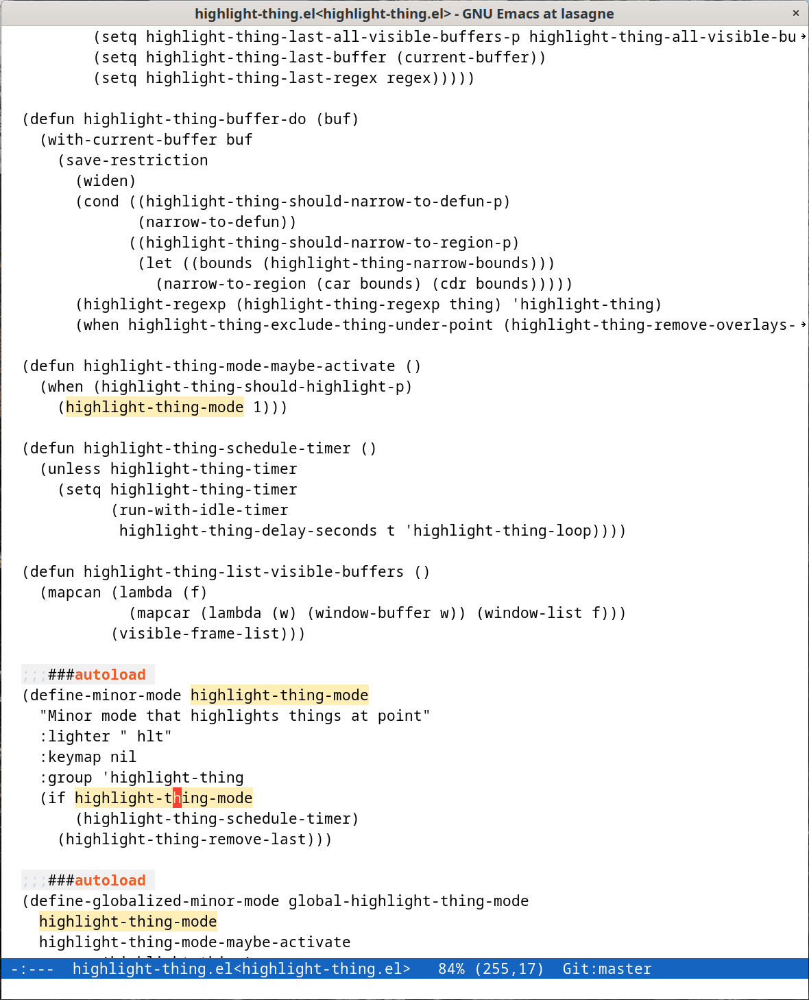

# highlight-thing.el

Global minor mode to highlight the thing under point.

[](https://melpa.org/#/highlight-thing)

Similar to `highlight-symbol-mode`, but does not rely on font-lock
functionality and does not provide functionality to navigate to different
occurrences of the current symbol under point.

No external dependencies, uses `thingatpt` and `hi-lock` functionality that is
included with GNU Emacs.



## Installation

Basic setup:

```emacs-lisp
  (require 'highlight-thing)
  (global-highlight-thing-mode)
```

Alternatively you can use the buffer-local version:

```emacs-lisp
  (add-hook 'prog-mode-hook 'highlight-thing-mode)
```

The default is to highlight the symbol under point, but you can customize
`hightlight-thing-what-thing` to highlight different components. Set the following to only
highlight the word under point:

```emacs-lisp
  (setq highlight-thing-what-thing 'word)
```

As an extension to the `thing-at-point` capabilities you can select `region` in
which case an active region is used as the thing to highlight (cf. [#7](https://github.com/fgeller/highlight-thing.el/issues/7)).

[@antoineB](https://github.com/antoineB) provided the functionality to use a custom regex function for a
thing-at-point - thanks! For his use case, cf. [#18](https://github.com/fgeller/highlight-thing.el/pull/18). To use it store the custom regex function as the
property `highlight-thing-regex-fn` on your `thing-at-point`:

```emacs-lisp
  (put 'word 'highlight-thing-regex-fn 'your-regex-fn)
```

Customize the face `hi-yellow` to change the colors that are used for
highlighting.

You can customize the delay before this mode attempts to highlight the thing
under point. For example, push it out to 1.5 seconds from the default 0.5:

```emacs-lisp
  (setq highlight-thing-delay-seconds 1.5)
```

You can limit the highlighting of things to the current defun via the
following setting:

```emacs-lisp
  (setq highlight-thing-limit-to-defun t)
```

You can configure the matching of occurrences to be case-sensitive via the following setting:

```emacs-lisp
  (setq highlight-thing-case-sensitive-p t)
```

If you want all the matches highlighted but not the one occurrence
at the point itself, you can do so by:

```emacs-lisp
  ;; Don't highlight the thing at point itself. Default is nil.
  (setq highlight-thing-exclude-thing-under-point t)
```

If you want to highlight the current region when active or thing at point
when inactive:

```emacs-lisp
  (setq highlight-thing-prefer-active-region t)
```

If you want to prevent highlighting certain strings:

```emacs-lisp
  (setq highlight-thing-ignore-list '("False" "True"))
```

If you want to highlight in all visible buffers:

```emacs-lisp
  (setq highlight-thing-all-visible-buffers-p t)
```

If you want to restrict the highlighting to lines surrounding points, e.g. to
reduce the load of highlighting in large buffers as in [#16](https://github.com/fgeller/highlight-thing.el/issues/16), consider
customizing the following variables:

```emacs-lisp
  (setq highlight-thing-limit-to-region-in-large-buffers-p nil
        highlight-thing-narrow-region-lines 15
        highlight-thing-large-buffer-limit 5000)
```
